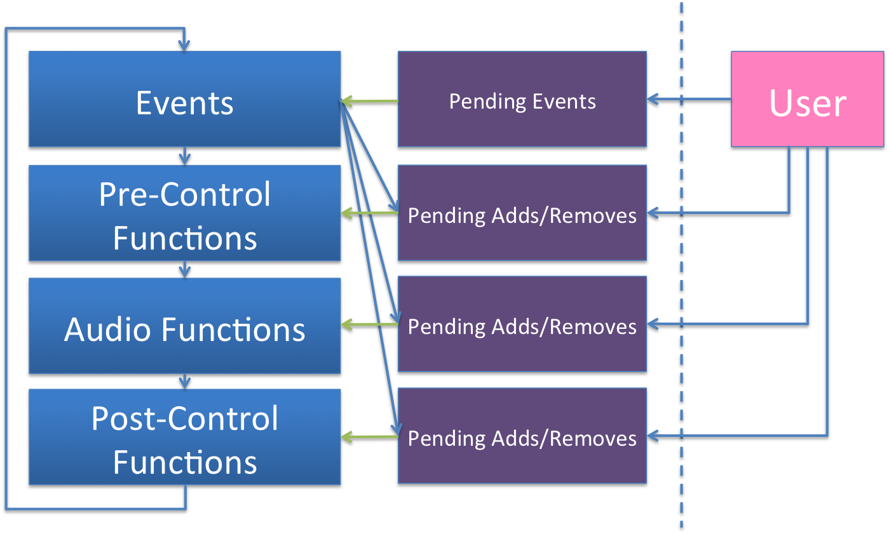

# Architecture 

The design of Pink is motivated by the concept of being a Minimal Engine. It is the goal in Pink's design to have a limited set of primitive abstractions that allow for supporting the widest variety of musical use cases.  

## Processing Model

Pink uses a block-based processing model (rather than a single-sample model).  It will process x number of samples at a time, where x is configured by the user using the :buffer-size option when creating an engine.  The default setting for engines is a buffer-size of 64 samples and 44100 sampling rate. 

Single-sample processing models allow for the highest temporal resolution for processing of events and control functions.  However, they also have a higher processing cost.  Using block-based processing allows for amortizing costs for each signal-processing unit generator, as they will generate x number of samples in a loop, using local variables for the duration of that loop, and do a store/restore of state only once per block. However, events will only be processed after every block, so timing may skew, and since some signal processing graphs require single-sample delays, special handling is required. 

Pink follows similar tradeoffs as found in Csound.  The user can work with one block size while rendering in realtime, but choose to use a smaller block-size (i.e. block-size = 1) for better event resolution when rendering to disk. Also, like Csound, parts of a signal processing graph can be set to process with smaller block-sizes.  For example, a portion of a graph can be run at block-size = 1, while the rest of the engine may run at block-size = 64.  

### Time

Pink's time counter begins at 0 and is incremented once per processing of its signal-processing graph. Time then is counted in number of blocks run since start.  As the user has access to the current block-size and sample-rate, the user can make calculations to figure out how much time has passed in clock time (i.e. number of seconds = (/ (\* time-counter block-size) sample-rate) ). Pink also has a system for tempo, allowing the user to set event start and duration times in numbers of beats, rather than in seconds.  By default, the tempo for the engine is set to 60 beats per minute, such that time values for events is processed as seconds.

### Synchronization 

For music systems, synchronization with an engine is an important concern. This allows for events to be timed together with the sound that is being produced, as well as allow control functions to operate together with the time of the engine.  To achieve this, event and control processing must be done in the thread of the engine. Pink offers three main constructs (audio functions, control functions, and events) that are all run within the main engine thread.  

Pink allows for two constructs for synchronization: events and control-functions.  Events are one time operations that are scheduled with the engine and will be fired when their start times are met.  Control-functions are continuous operations that will run until they return a false value. Event processing and control-function calling is done once per rendering of the audio graph.  Events and control-functions have access to the engine's current time counter and are processed in sync with the audio-graph.

## Main Thread

Pink uses a single-threaded design. The main thread in Pink is responsible for running the engine. Each time through the loop, the engine has three main tasks: running any events that are scheduled to run at the current engine time, processing the control function graphs, and processing the audio function graph. When processing the audio graph, the engine is responsible for taking the returned audio samples and writing that to the soundcard or to disk.  

Additionally, the engine may respond to two messages, one for clearing the engine and one for stopping the engine. 

## High-Level Abstractions

### Audio Functions

Audio functions are functions that are called once per engine cycle and either generate audio buffers or, if complete, return nil.  These are the primary functions used to generate audio, and are generally assembled into sub-graphs that are attached to the overall audio processing graph for the engine. Users will use audio functions to create things like instruments, mixers, and effects.  Some audio functions will be infinite in duration while others are finite.  Audio functions often depend on other audio functions; if a dependent audio function is done (returns nil), then the current audio function must also return nil. 

### Control Functions

Control functions are functions that are called once per engine cycle and either return true or false, depending on if they are still running or are done. Control functions can generally used for side-effects.  They may be used to create sample-accurate clocks for manually triggering events, model performers, or be used as a callback mechanism by application code.

### Events

Events are timed function calls.  Events are most often used to represent notes (i.e. play this instrument at time x), but events are generic in Pink.  Any function can be called by a Pink event. For example, an event can be used to turn off the engine at a given time. Events can schedule new events, as is commonly done in temporal recursion. Pink events are higher-order, meaning arguments to the event may in themselves be functions. 

